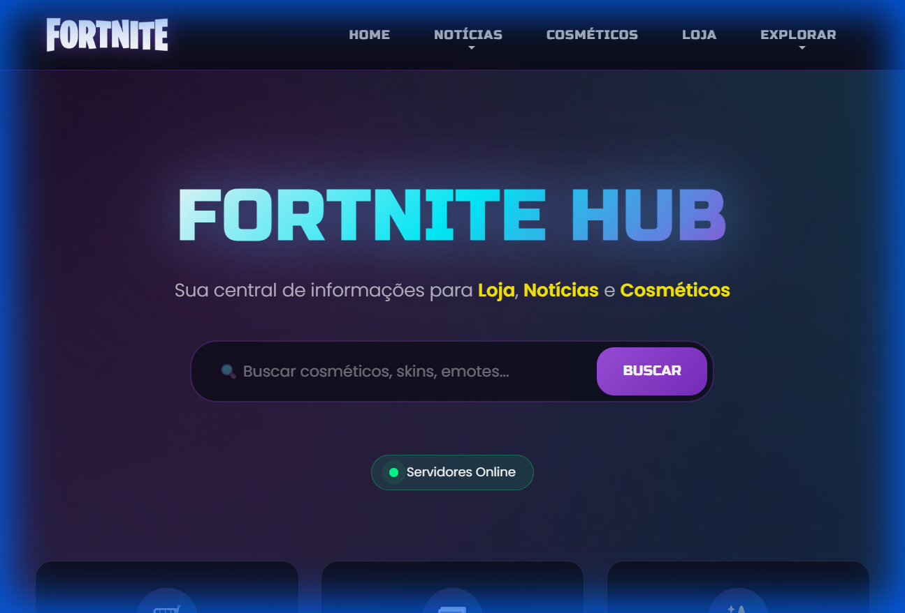
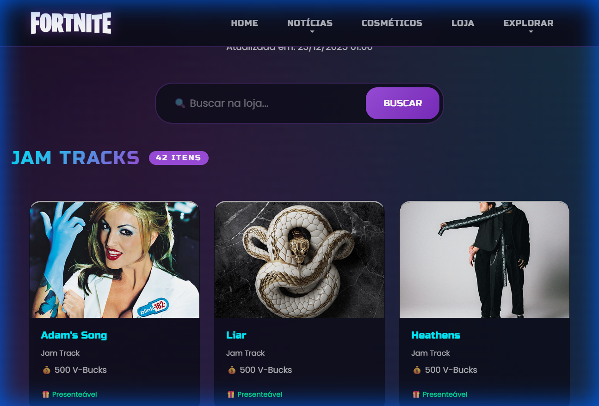
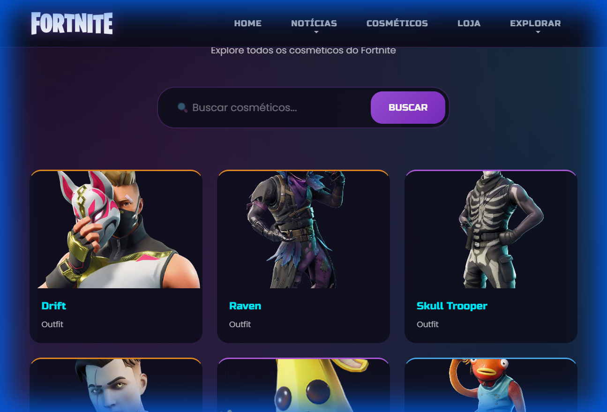
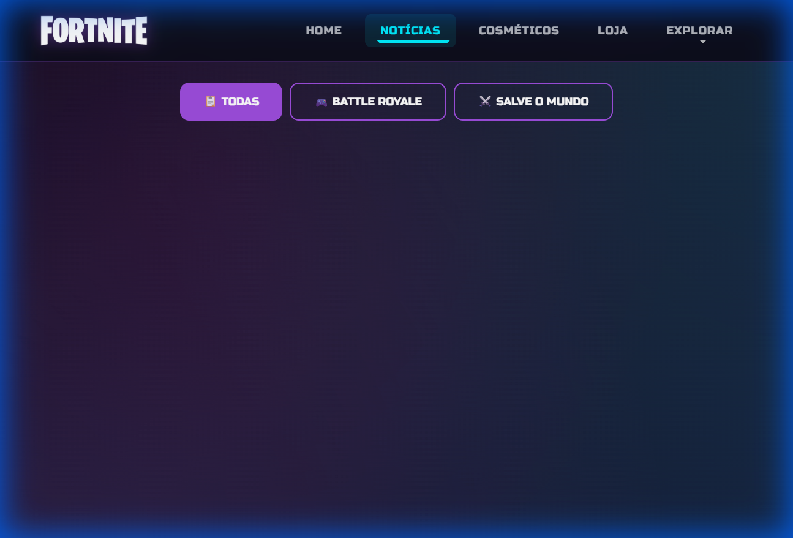
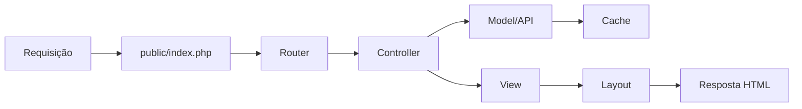

<div align="center">

# 🎮 FORTNITE HUB

### Portal de Informações do Fortnite em Tempo Real

[](https://php.net)
[](https://en.wikipedia.org/wiki/Model%E2%80%93view%E2%80%93controller)
[](https://www.php-fig.org/psr/psr-4/)
[](https://docker.com)
[](https://web.dev/progressive-web-apps/)

<p align="center">
  <b>Um portal moderno e responsivo para visualizar dados do Fortnite em tempo real, incluindo loja diária, cosméticos, notícias e estatísticas de jogadores.</b>
</p>

</div>

---

## 📸 Screenshots

<div align="center">

### 🏠 Página Inicial


### 🛒 Loja Diária


### ✨ Catálogo de Cosméticos


### 📰 Notícias


</div>

---

## ✨ Funcionalidades

| Funcionalidade | Descrição |
|----------------|-----------|
| 🏠 **Home** | Dashboard com preview dos itens da loja |
| 🛒 **Loja Diária** | Todos os itens disponíveis hoje com busca e filtros |
| ✨ **Cosméticos** | Catálogo completo com scroll infinito e detalhes |
| 📰 **Notícias** | Últimas notícias de Battle Royale e Save the World |
| 🗺️ **Mapa** | Mapa atual do jogo com POIs interativos |
| 🎮 **Modos de Jogo** | Lista de todos os modos disponíveis |
| 🔍 **Estatísticas** | Busca de estatísticas de qualquer jogador |
| 📱 **PWA** | Instalável como aplicativo no celular |

---

## 🏗️ Arquitetura

O projeto segue a arquitetura **MVC (Model-View-Controller)** com padrões modernos PHP:

```
Fortnite/
├── app/                        # Código da aplicação
│   ├── Controllers/            # 7 Controllers (Home, Shop, Cosmetics, etc.)
│   ├── Models/                 # FortniteAPI Model com cache
│   ├── Views/                  # Templates PHP organizados
│   │   ├── layouts/            # Layout principal
│   │   ├── home/, shop/...     # Views por funcionalidade
│   │   └── errors/             # Páginas 404/500
│   └── Core/                   # Router, Controller base, Cache
├── public/                     # Arquivos públicos (DocumentRoot)
│   ├── index.php               # Front Controller
│   ├── css/                    # Estilos
│   ├── img/                    # Imagens
│   └── sw.js                   # Service Worker (PWA)
├── tests/                      # Testes PHPUnit
├── docker/                     # Configuração Docker
├── cache/                      # Cache de API
└── docs/                       # Documentação e screenshots
```

### Fluxo de Requisição



---

## 🚀 Quick Start

### Opção 1: XAMPP (Recomendado para Windows)

```bash
# Clone o repositório para a pasta htdocs
git clone https://github.com/AndersonC96/fortnite-hub.git C:/xampp/htdocs/Fortnite

# Configure o ambiente
cd C:/xampp/htdocs/Fortnite
copy .env.example .env

# Edite o .env com sua API key
# FORTNITE_API_KEY=sua_api_key_aqui

# Acesse no navegador
# http://localhost/Fortnite/public/
```

### Opção 2: Docker

```bash
# Clone e entre no diretório
git clone https://github.com/AndersonC96/fortnite-hub.git
cd fortnite-hub

# Configure variáveis de ambiente
cp .env.example .env
# Edite .env com sua FORTNITE_API_KEY

# Inicie com Docker Compose
docker-compose up -d

# Acesse
# http://localhost:8080/
```

### Opção 3: PHP Built-in Server

```bash
# Com Composer instalado
composer install
composer start

# Acesse
# http://localhost:8000/
```

---

## ⚙️ Configuração

### Variáveis de Ambiente (.env)

```env
# API Configuration
FORTNITE_API_KEY=sua_api_key_aqui
FORTNITE_API_URL=https://fortnite-api.com/v2/

# Application
APP_ENV=development
APP_DEBUG=true

# Cache
CACHE_ENABLED=true
CACHE_TTL=300
```

### Obter API Key

1. Acesse [fortnite-api.com](https://fortnite-api.com/)
2. Crie uma conta gratuita
3. Copie sua API Key
4. Cole no arquivo `.env`

---

## 🛣️ Rotas

| Método | Rota | Descrição |
|--------|------|-----------|
| GET | `/` | Página inicial |
| GET | `/shop` | Loja do dia |
| GET | `/cosmetics` | Lista de cosméticos |
| GET | `/cosmetics/{id}` | Detalhes do cosmético |
| GET | `/cosmetics/api` | API para scroll infinito |
| GET | `/news` | Todas as notícias |
| GET | `/news/br` | Notícias Battle Royale |
| GET | `/news/stw` | Notícias Save the World |
| GET | `/map` | Mapa do jogo |
| GET | `/modes` | Modos de jogo |
| GET | `/player` | Buscar jogador |

---

## 🧪 Testes

```bash
# Instalar dependências de desenvolvimento
composer install

# Executar todos os testes
composer test

# Executar com cobertura de código
composer test:coverage
```

### Estrutura de Testes

```
tests/
├── bootstrap.php           # Configuração inicial
└── Unit/
    ├── RouterTest.php      # Testes do Router
    ├── CacheTest.php       # Testes do Cache
    └── FortniteAPITest.php # Testes da API
```

---

## 📚 Padrões PHP

| Padrão | Implementação |
|--------|---------------|
| **PSR-4** | Autoloading com namespace `FortniteHub\` |
| **PSR-12** | Coding style com `declare(strict_types=1)` |
| **Type Hints** | Parâmetros e retornos tipados |
| **PHPDoc** | Documentação completa de métodos |

---

## 🐳 Docker

### Build Manual

```bash
docker build -t fortnite-hub .
docker run -p 8080:80 -e FORTNITE_API_KEY=sua_key fortnite-hub
```

### Docker Compose

```bash
docker-compose up -d      # Iniciar
docker-compose down       # Parar
docker-compose logs -f    # Ver logs
```

---

## 🔄 CI/CD

O projeto inclui GitHub Actions com:

- ✅ **Lint**: Verificação de sintaxe PHP
- ✅ **Tests**: Testes automatizados PHPUnit
- ✅ **Security**: Scan de vulnerabilidades com Trivy
- ✅ **Build**: Build de imagem Docker
- ✅ **Deploy**: Deploy automático (configurável)

---

## 📱 PWA

O Fortnite Hub é um Progressive Web App instalável:

- ✅ **Instalável** em dispositivos móveis
- ✅ **Funciona offline** (cache de assets)
- ✅ **Ícones personalizados** e splash screen
- ✅ **Push notifications** (preparado)

---

## 🛡️ Segurança

| Medida | Descrição |
|--------|-----------|
| **API Key** | Armazenada em variável de ambiente |
| **XSS** | Sanitização com `htmlspecialchars()` |
| **Headers** | X-Frame-Options, X-XSS-Protection |
| **HTTPS** | Pronto para produção |
| **.gitignore** | Proteção de arquivos sensíveis |

---

## 🎨 Design

O design segue a estética do Fortnite:

- **Tema**: Dark mode com gradientes neon
- **Cores**: Purple (#9d4edd), Blue (#00f0ff), Pink (#ff6b9d)
- **Fontes**: Russo One + Poppins (Google Fonts)
- **Animações**: Transições suaves e hover effects
- **Responsivo**: Mobile-first design

---

## 🔗 APIs Utilizadas

| API | Uso |
|-----|-----|
| [Fortnite-API.com](https://fortnite-api.com/) | Loja, cosméticos, notícias, modos |
| [FortniteAPI.io](https://fortniteapi.io/) | Mapa |

---

## 📦 Dependências

### Produção
- PHP 8.0+
- cURL extension
- mod_rewrite (Apache)

### Desenvolvimento
- PHPUnit 10.x
- PHP-CS-Fixer 3.x

---

## 🤝 Contribuindo

1. Fork o projeto
2. Crie uma branch: `git checkout -b feature/nova-feature`
3. Commit: `git commit -m 'Adiciona nova feature'`
4. Push: `git push origin feature/nova-feature`
5. Abra um Pull Request

---

## 📄 Licença

Este projeto está sob a licença MIT - veja o arquivo [LICENSE](LICENSE) para detalhes.

---

<div align="center">

**Desenvolvido por Anderson Cavalcante como projeto de portfólio**

[](https://github.com/AndersonC96/fortnite)

</div>